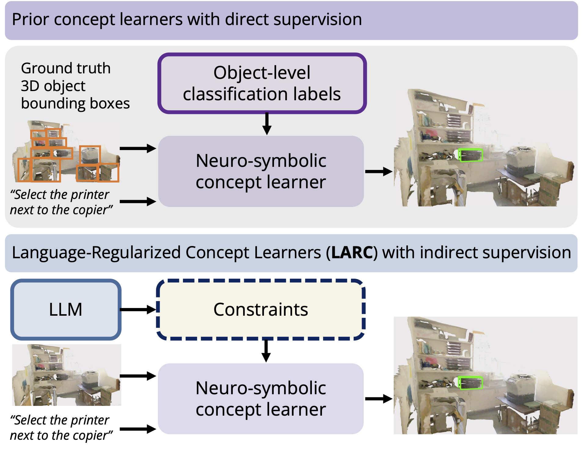

# Naturally Supervised 3D Visual Grounding with Language-Regularized Concept Learners



<br />
<br />
**Naturally Supervised 3D Visual Grounding with Language-Regularized Concept Learners**
<br />
[Chun Feng*](https://chunfeng3364.github.io/),
[Joy Hsu*](http://web.stanford.edu/~joycj/),
[Weiyu Liu](http://weiyuliu.com/),
[Jiajun Wu](https://jiajunwu.com/)
<br />
In Conference on Computer Vision and Pattern Recognition (CVPR) 2024
<br />

[[paper](https://arxiv.org/abs/2404.19696)]  [[project page](https://chunfeng3364.github.io/projects/larc_website/project_page.html)]

## Dataset
Our dataset download process follows the [ReferIt3D benchmark](https://github.com/referit3d/referit3d).

Specifically, you will need to
- (1) Download `sr3d_train.csv` and `sr3d_test.csv` from this [link](https://drive.google.com/drive/folders/1DS4uQq7fCmbJHeE-rEbO8G1-XatGEqNV)
- (2) Download scans from ScanNet and process them according to this [link](https://github.com/referit3d/referit3d/blob/eccv/referit3d/data/scannet/README.md). This should result in a `keep_all_points_with_global_scan_alignment.pkl` file.

## Object Predictions

In LARC, we use [votenet](https://github.com/facebookresearch/votenet) as our object detector to get object predictions. We pretrained votenet on SR3D dataset. Our object predictions can be found at `README-votenet_objects.md`.

## Setup

Run the following commands to install necessary dependencies.

```bash
  conda create -n larc python=3.7.16
  conda activate larc
  pip install -r requirements.txt
```

Install [Jacinle](https://github.com/vacancy/Jacinle).
```bash
  git clone https://github.com/vacancy/Jacinle --recursive
  export PATH=<path_to_jacinle>/bin:$PATH
```

Install the referit3d python package from [ReferIt3D](https://github.com/referit3d/referit3d).
```bash
  git clone https://github.com/referit3d/referit3d
  cd referit3d
  pip install -e .
```

Compile CUDA layers for [PointNet++](http://arxiv.org/abs/1706.02413).
```bash
  cd models/scene_graph/point_net_pp/pointnet2
  python setup.py install
```


## Evaluation

To evaluate LARC:

```bash

  scannet=<path_to/keep_all_points_with_global_scan_alignment.pkl>
  referit=<path_to/sr3d_train.csv>
  object=<path_to_object_predictions>
  load_path=<path_to/model_to_evaluate.pth>
  
  jac-run ns3d/trainval.py --desc ns3d/desc_ns3d.py --scannet-file $scannet --referit3D-file $referit --object_data_path $object --load $load_path --evaluate
```

Weights for our trained LARC model can be found at [trained_larc.pth](https://drive.google.com/file/d/1ApG1KACx6bAp6yPRHDFnBibraq7TJglB/view?usp=drive_link) and loaded into `load_path`.


## Training

To train LARC:

```bash

  scannet=<path_to/keep_all_points_with_global_scan_alignment.pkl>
  referit=<path_to/sr3d_train.csv>
  object=<path_to_object_predictions>
  
  jac-run ns3d/trainval.py --desc ns3d/desc_ns3d.py --scannet-file $scannet --referit3D-file $referit --object_data_path $object --lr 0.001 --epochs 60 --save-interval 1 --validation-interval 1
```


## Acknowledgements

Our codebase is built on top of [NS3D](https://github.com/joyhsu0504/NS3D) and [votenet](https://github.com/facebookresearch/votenet). Please feel free to email me at fengchun3364@mail.ustc.edu.cn if any problems arise.
